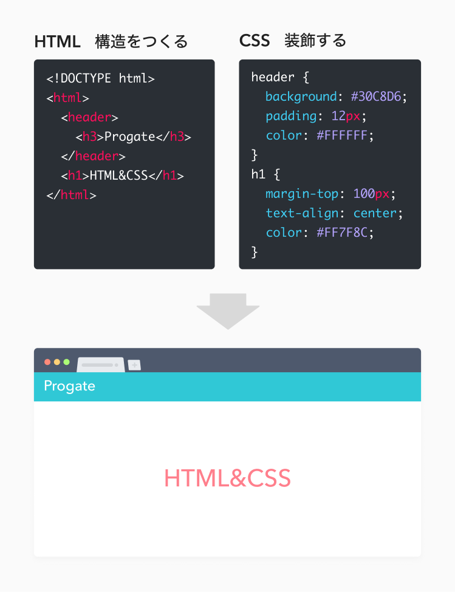

HTML/CSSはWebページを作るために使われる言語です。

インターネット上に公開されているホームページや物販ページ（ECサイト）は、Webサーバー上にHTML/CSSで作成したファイルを置く事で、全世界の皆に公開することが出来ます。

HTMLは文字や画像など表示する対象とその構造を指定する役割があり、表示対象の特性に応じて様々な"タグ"を使用してWebページに表示する構造を記述します。

CSSは色やレイアウトなど見た目を装飾する役割を担っており、HTMLで記述した"タグ"要素に対して"プロパティ"で見た目を指定します。

### 学ぶ目的
HTML/CSSはWebページを作るうえでは欠かせない言語です。HTML/CSSの基礎を学べば、あなただけのWebページを作ることができるようになります。

また、HTML/CSSは初学者に適した学習項目です。理由は、書いたコードを目に見える形ですぐに確認することができるからです。

HTML/CSSの開発を通して「コードを書く➡確認する➡コードを修正する」のようなプログラミングに欠かせないが開発サイクルを簡単に体験することができます。

あなたのWebページが完成するときにはプログラミングでゼロから何かを生み出す楽しさに気づくかもしれません。

## 学んでみよう

### 学習の目安

#### 基本
- HTMLとCSSの役割を説明できる
- ボックスモデルでレイアウトを組むことができる
- HTMLのタグの属性やCSSのプロパティを調べて使うことができる
- レスポンシブなページを作ることができる
- HTMLとCSSの役割を説明できる
- 自分で環境を用意して実装することができる

#### 応用
- CSSが適用される優先順位を説明できる
- Webアクセシビリティに対応したページを作れる

 

### 全体像を掴むには
見た目を作る上で必要な最低限の知識は多くはありません。HTMLの基本的なタグと見た目を整える基本的なCSSを押さえることができればWebページを作り始めることができます。

まずは最低限のHTMLとCSSの知識を身につけ、実際に自分で作ってみることで全体像の感覚を掴みましょう。

また、エディタやブラウザ、ファイル、そしてURLパスなどの基本的な用語を学んでおくと教材の説明を理解する助けになるでしょう。慣れてきたら「HTML タグ」や「CSS プロパティ」などでより深く学んでみましょう！
